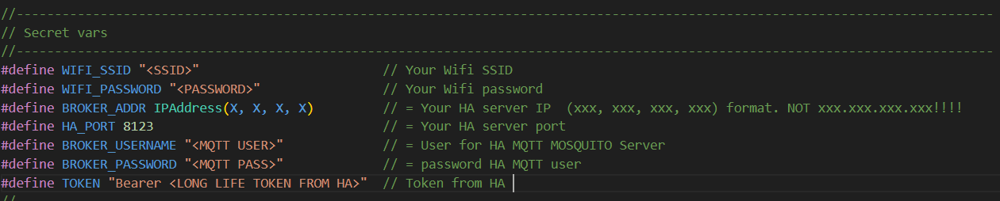
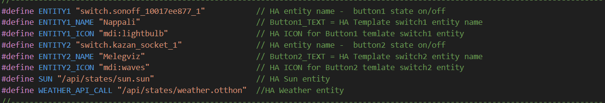

# WallPanel01

Simple 2-button touchscreen wall panel with MQTT Home Assistant integration.

Tested with:
ESP32-S3-DEVKIT and 240x320 2.8" SPI TFT LCD with touch (ILI9341 + XTP2046 Touch driver)

## Before compile
Set your secret data in this section:

Set your Home Assistant entity in this section:

* ENTITY1: is the HOME ASSISTANT entity you want to control (button or switch type) 
* ENTITY1_NAME: helper entity name, anything you like and fits the requirements of Home Assistant.
* ENTITY1_ICON: helper entity material icon.

* ENTITY2: second HOME ASSISTANT entity you want to control (button or switch type)
* ENTITY2_NAME: helper entity name, anything you like and fits the requirements of Home Assistant.
* ENTITY2_ICON: helper entity material icon.

* WEATHER_API_CALL: change your weather entitiy, for example weather.home => /api/state/weather.home
